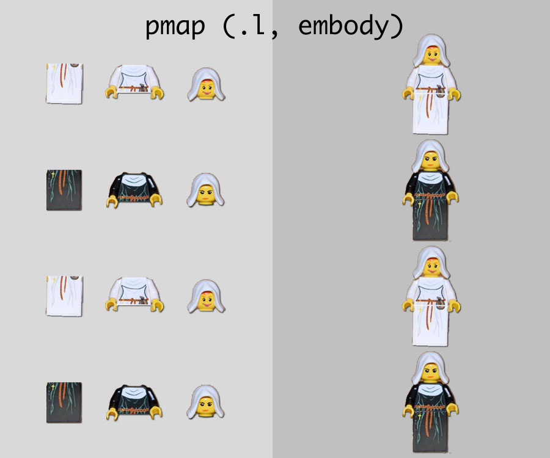
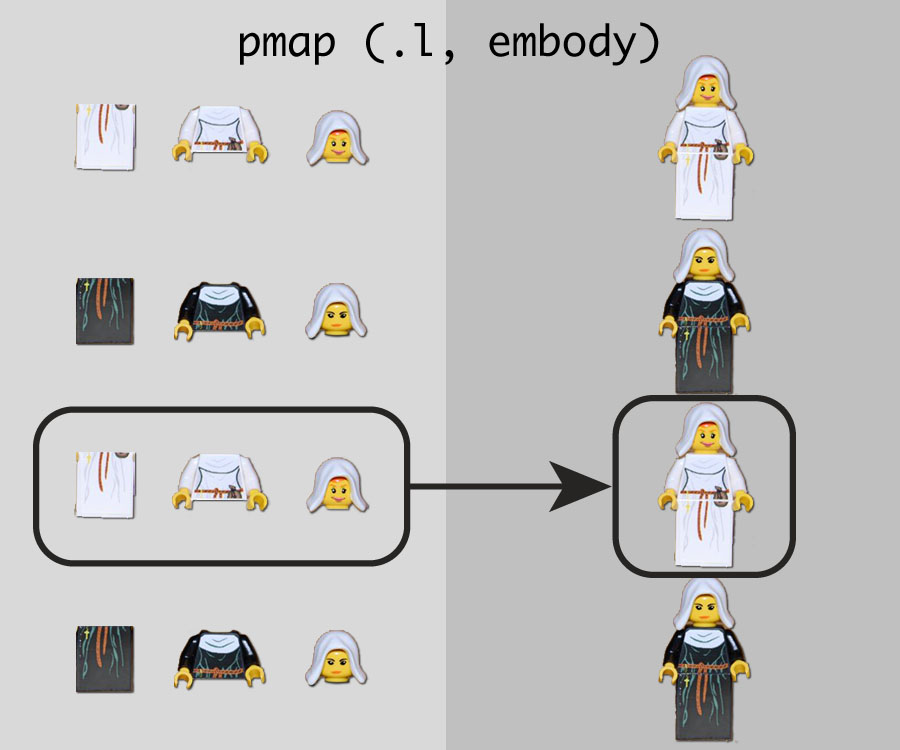

```{r setup, include=FALSE}
options(htmltools.dir.version = FALSE)
library(tidyverse)
library(knitr)
set.seed(78987)
```

background-image: url(images/purrr_hex.png)
background-size: contain

???
Definitely one of the cuter, softer hex stickers from the tidyverse.

Image credit: [Rstudio](www.rstudio.com)

---
class: inverse, center, middle

# purrr's map functions
# let's get started


---
# purrr package

purrr enhances R’s functional programming toolkit (read: the apply family of functions) by providing a complete and consistent set of tools for working with functions and vectors

best place to start is the family of `map()` functions which allow you to replace many for loops* with code that is more succinct and easier to read

`map()` functions transform their input by applying a function to each element and returning a vector the same length as the input

.footnote[[*] And much much more]
---
# purrr::map vs base::apply

base apply is to *Sister Act* as purrr map is to $\rule{3cm}{0.45mm}$ ?

???
This is reminiscent of an SAT prep question.
---
# purrr::map vs base::apply

base apply is to *Sister Act* as purrr map is to ***Sister Act 2: Back in the Habit*, the sequel to a great film that is even better than the first!**

.pull-left[

]

.pull-right[

]

.footnote[.tiny[www.impawards.com]]

???
The base apply functions are great and incredibly useful.  But they can be difficult to use, and the purrr family of functions does just that.
---
# base::apply

.pull-left[
- first argument to `lapply()` is the data; the first argument to `mapply()` is the function
  
- no consistent way to pass additional arguments; most use `...`, `mapply()` uses `MoreArgs`, and some require you to create a new anonymous function

- output from `*apply()` is not consistent 
]

--

.pull-right[
- `v-`, `s-`, and `mapply()` uses `USE.NAMES = FALSE` to suppress names in output; `lapply()` does not have this argument


]
---
# purrr::map

.pull-left[
- the `map*()` family has greater consistency among functions

- `map()`, `map2()`, and `pmap()` inputs are the same and allow for flexible input
  
- consistent methods for passing additional arguments
]
--
.pull-right[
- the output from the map family of functions is predictable and easily modifiable


]
---
class: inverse
# use cases

.large[ 
1. subgroup analyses

1. sensitivity analyses

1. reading all files in a folder

1. bootstrap analyses

1. other purrr package functions
]
---
# usage
```{r, eval=FALSE}
map(.x, .f, ...)
```
    .x     A list or atomic vector  
    .f     A function or formula  
             If a function, it is used as is  
             If a formula (e.g. ~ .x +2), if is converted to a function  
               - For a single argument function, use `.`, `.x`, or `..1`  
    ...    Additional arguments passed on to the mapped function
--
```{r eval=TRUE, tidy=TRUE}
a = list(1:3, 4:6, 7:9)
map(a, sum) #<<
```

???
To start, let's get some basic syntax out of the way.
---
# usage
pass a functon name to `map()`

additional function arguments can be passed as well
```{r eval=FALSE, tidy=FALSE}
map(a, sum)
map(a, sum, na.rm = FALSE)
```
--
create a new function with `function(x)`
```{r eval=FALSE, tidy=FALSE}
map(a, function(x) sum(x))
```
--
use the `~` shortcut to create a function
```{r eval=FALSE, tidy=FALSE}
map(a, ~sum(.))
map(a, ~sum(.x))
{{map(a, ~sum(..1))}}
```
---
# usage
```{r, eval=FALSE}
map2(.x, .y, .f, ...)
pmap(.l, .f, ...)
```
    .x, .y A list or atomic vector  
    .l     A list of vectors
    .f     A function or formula  
             If a function, it is used as is  
             If a formula (e.g. ~ .x +2), if is converted to a function  
               - For two arguments use `.x` and `.y`, or `..1` and `..2`
               - For more arguments, use `..1`, `..2`, `..3`, etc.
    ...    Additional arguments passed on to the mapped function
--
```{r eval=FALSE, tidy=FALSE}
a = list(1:3, 4:6, 7:9)
b = list(9:7, 6:4, 3:1)
map2(a, b, ~sum(c(.x, .y)))
pmap(list(a, b), ~sum(c(.x, .y)))
```
--
```{r eval=FALSE, tidy=FALSE}
map2(a, b, ~sum(c(..1, ..2)))
pmap(list(a, b), ~sum(c(..1, ..2)))
```
---


???
This lego example was lifted from a talk by Jenny Bryan.
I took it and made them nun legos to be more on theme :)
---

---
## trial dataset

```{r, echo=TRUE, eval=FALSE}
library(biostatR)
trial %>%
  fmt_table1(by ="trt", missing = "no") %>%
  add_n()
```
.small[
```{r, echo=FALSE}
library(biostatR)
trial %>%
  fmt_table1(by ="trt", missing = "no") %>%
  add_n() %>%
  as_tibble() %>%
  knitr::kable(format = "html")
```
]
---
class: inverse
# use cases

.large[ 
1. _**subgroup analyses**_

1. sensitivity analyses

1. read all files in a folder

1. bootstrap analyses

1. other purrr package functions
]

---
# subgroup analysis
tidyr::nest + purrr::map 
```{r, echo=TRUE, eval=TRUE}
trial %>%
  group_by(grade) %>%
  nest() 
```
--
tibbles share the same structure as data frames

tibbles are a list of vectors, and it is possible to have a list column

very useful because a list can contain any other object: this means you can put any object in a tibble! 

allows you to keep related objects together in a row, no matter how complex the individual objects are
???
When performing subgroup analyses, the nest function is your best friend.  Explain nest function here.
---
# subgroup analysis
tidyr::nest + dplyr::mutate + purrr::map
```{r, echo=TRUE, eval=TRUE}
trial %>%
  group_by(grade) %>%
  nest() %>%
  mutate(
    cross_tab = map(data, ~ table(.x[["response"]], .x[["trt"]])), #<<
    chi_sq = map(cross_tab, ~ chisq.test(.)),                      #<<
    p_value = map(chi_sq, ~ ..1[["p.value"]])                      #<<
  )
```
--
**we want the p-values, not a list of p-values!**
---
# subgroup analysis
tidyr::nest + dplyr::mutate + purrr::map_dbl
```{r, echo=TRUE, eval=TRUE}
trial %>%
  group_by(grade) %>%
  nest() %>%
  mutate(
    cross_tab = map(data, ~ table(.x[["response"]], .x[["trt"]])), 
    chi_sq = map(cross_tab, ~ chisq.test(.)),                      
    p_value = map_dbl(chi_sq, ~ ..1[["p.value"]])                   #<<
  )
```

---
# output types

the default output of `map()` is a list 

we can coerce the output type with `map_*()`

```{r, echo = FALSE, eval=TRUE}
tibble(
  `function` = c("map()", "map_dbl()", "map_int()", "map_lgl()", "map_dfr()", "map_dfc()"),
  `output type` = c("list", "double", "integer", "logical", "tibble (bind_rows)", "tibble (bind_cols)")
) %>%
  knitr::kable(format = "html")
```

when using the `map_*()` functions, `map()` runs as it typically would with the added step of coercing the output at the end

tip: make sure your code works with `map()` before adding `map_*()`.
---
class: inverse
# use cases

.large[ 
1. subgroup analyses

1. _**sensitivity analyses**_

1. read all files in a folder

1. bootstrap analyses

1. other purrr package functions
]

---
# sensitivity analyses
run your analysis among
- all patients (`TRUE`)
- excluding low grade patients (`grade != 'I'`)
```{r, echo=TRUE, eval=TRUE}
tibble(
  cohort = c("TRUE", "grade != 'I'") #<<
) %>% 
kable(format = "html")
```
---
# sensitivity analyses
run your analysis among
- all patients (`TRUE`)
- excluding low grade patients (`grade != 'I'`)
```{r, echo=TRUE, eval=FALSE}
tibble(
  cohort = c("TRUE", "grade != 'I'")
) %>%
mutate(
  data = map(cohort, ~ trial %>% filter_(.x)), #<<
  p_value = map_dbl(
    data,
    ~ table(.x[["response"]], .x[["trt"]]) %>%
      chisq.test() %>%
      pluck("p.value")
  )
)
```

---
# sensitivity analyses
```{r, echo=TRUE, eval=TRUE}
tibble(
  cohort = c("TRUE", "grade != 'I'")
) %>%
mutate(
  data = map(cohort, ~ trial %>% filter_(.x)), #<<
  p_value = map_dbl(
    data,
    ~ table(.x[["response"]], .x[["trt"]]) %>%
      chisq.test() %>%
      pluck("p.value")
  )
)
```
---
# sensitivity analyses
you can also save figures in a tibble
```{r, echo=TRUE, eval=TRUE}
tibble(
  cohort = c("TRUE", "grade != 'I'")
) %>%
mutate(
  data = map(cohort, ~ trial %>% filter_(.x)),
  ggplt = map(                                 #<<
    data,                                      #<<
    ~ ggplot(.x, aes(x = age, y = marker)) +   #<<
      geom_point()                             #<<
  )                                            #<<
)
```
---
class: inverse
# use cases

.large[ 
1. subgroup analyses

1. sensitivity analyses

1. _**read all files in a folder**_

1. bootstrap analyses

1. other purrr package functions
]
---
# read files
store vector of the files you want to import
```{r, echo=TRUE, eval=TRUE}
    file_list = list.files(pattern = "*.csv", recursive = TRUE)
```
--
use `map()` to read the files. 
- returns a list where each element is a tibble  
```{r, echo=TRUE, eval=TRUE, message=FALSE}
    map(file_list, read_csv)
```
---
# read files
append each of the data sets with the `map_dfr()` function   
- after files have been imported, `bind_rows()` will create one final tibble
```{r, echo=TRUE, eval=FALSE}
    map_dfr(file_list, read_csv)
```
--
include an identifier with a piped `mutate()` 
```{r, echo=TRUE, eval=TRUE, message=FALSE}
    map_dfr(file_list, ~read_csv(.x) %>% mutate(file = .x))
```

---
class: inverse
# use cases

.large[ 
1. subgroup analyses

1. sensitivity analyses

1. read all files in a folder

1. _**bootstrap analyses**_

1. other purrr package functions
]
---
# bootstrap analyses

use bootstrap re-sampling to estimate the difference in response rate by treatment

we'll use 500 re-sampled data sets to estimate the standard deviation of the response rate difference 

assuming normality of the response rate difference, construct a 95% confidence interval for the difference

```{r, eval=TRUE, echo=TRUE}
# create function to calculate risk difference
risk_diff <- function(data) {
  mean(data$response[data$trt == "Drug"], na.rm = TRUE) - 
    mean(data$response[data$trt == "Placebo"], na.rm = TRUE)
}
```

---
# bootstrap analyses
```{r, eval=TRUE, echo=TRUE, message=FALSE, warning=FALSE}
# resample dataset 500 times and calculate risk difference
risk_diff_boot <- map_dbl(
  1:500,
  ~ trial %>% 
    slice(sample.int(n(), replace = TRUE)) %>%
    risk_diff()
  ) 
```
```{r, eval=TRUE, echo=FALSE, fig.height=3, dev='svg', message=FALSE}
 tibble(x = risk_diff_boot) %>%
  ggplot(aes(x = x)) +
  geom_histogram() +
  theme_bw() +
  labs(x = "Response Rate Difference")
```

---
# bootstrap analyses

the result
```{r, eval=TRUE, echo=FALSE}
risk_diff_sd <- sd(risk_diff_boot) 

r1 <-
  c(
    risk_diff(trial),
    risk_diff(trial) - qnorm(0.975) * risk_diff_sd,
    risk_diff(trial) + qnorm(0.975) * risk_diff_sd
  ) %>%
  fmt_percent() %>%
  paste0("%") %>%
  {glue:::glue(
    "{.[1]} (95% CI {.[2]}, {.[3]})"
  )} 
```
- `r r1`  

--
  
how do the results compare to the the Wald CI?

--
```{r, eval=TRUE, echo=FALSE}
r2 <-
  DescTools::BinomDiffCI(
    52, 101,
    30, 90
  ) %>%
  fmt_percent() %>%
  paste0("%") %>%
  {glue:::glue(
    "{.[1]} (95% CI {.[2]}, {.[3]})"
  )} 
```
- `r r2`  


.large[**Success!**]
---
class: inverse
# use cases

.large[ 
1. subgroup analyses

1. sensitivity analyses

1. read all files in a folder

1. bootstrap analyses

1. _**other purrr package functions**_
]

---
# other purrr functions
.pull-left[
- `modify()`

- `imap()`

- `keep()` and `discard()`

- `pluck()` and `chuck()`

- `cross_df()`

- `possibly()`, `safely()`, and `quietly()`
]
.pull-right[

.small[Yes, Lauren Hill was in *Sister Act 2*!]
]
---
# `modify()`

unlike `map()` and its variants which always return a fixed object type (list for map(), integer vector for `map_int()`, etc), the `modify()` family always returns the same type as the input object

```{r, eval=TRUE, echo=TRUE}
modify(c("hello", "world"), ~ .x)
modify(1:3, ~ .x)
```

---
# `imap()`
`imap(x, ...)` is short hand for `map2(x, names(x), ...)` if `x` has names, or `map2(x, seq_along(x), ...)` if it does not 

```{r, eval=TRUE, echo=TRUE}
trial %>% select(age, marker) %>%
  imap(~ glue::glue("{.y}: {mean(.x, na.rm = TRUE)}"))
```
--
```{r, eval=TRUE, echo=TRUE}
trial %>% select(age, marker) %>%
  map2(., names(.), ~ glue::glue("{.y}: {mean(.x, na.rm = TRUE)}"))
```

---
# `keep()` and `discard()`
keep or discard elements of a list or vector

```{r, eval=TRUE, echo=TRUE}
1:10 %>%
  keep(~. < 5) 

1:10 %>%
  discard(~.x >= 5)
```

---
# `pluck()`
pluck is similar to `[[` and selects a single element from a list or vector 

use position or name to select item

pluck is easier to read when used with the pipe (`%>%`)

```{r, eval=TRUE, echo=TRUE}
lm(mpg ~ vs, mtcars) %>% 
  pluck("coefficients")
```

---
# `cross_df()`

like `expand.grid()` without the factors...finally!

```{r, eval=TRUE, echo=TRUE}
list(
  outcome = c("mets", "death"),
  cohort = c("tpsa > 0", "tpsa > 1")
) %>%
  cross_df()
```

check out `cross()`, `cross2()`, `cross3()` 

they are similar, but return lists rather than a tibble
---
# `possibly()`, `safely()`, and `quietly()`

these functions wrap functions so that instead of generating side effects through printed output, messages, warnings, and errors, they return enhanced output

similar to `try()` and `tryCatch()`

`safely()` wrapped function returns a list with components `result` and `error`

`quietly()` wrapped function instead returns a list with components `result`, `output`, `messages` and `warnings`

`possibly()` wrapped function uses a default value (otherwise) whenever an error occurs

---
# done!


questions?

 slides available at <a href="http://www.danieldsjoberg.com/purrr-for-biostatisticians">danieldsjoberg.com/purrr-for-biostatisticians</a>

 souce code available at <a href="https://github.com/ddsjoberg/purrr-for-biostatisticians">github.com/ddsjoberg/purrr-for-biostatisticians</a>

